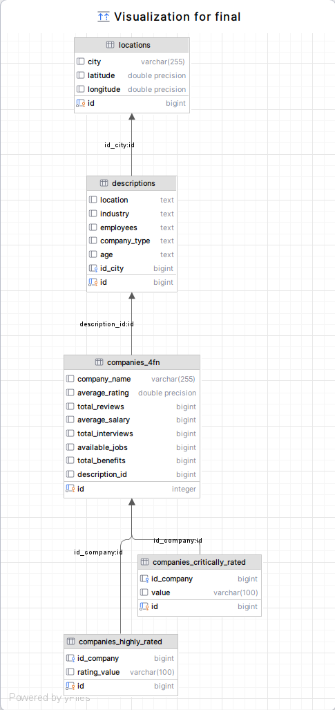

# Proyecto Bases de Datos

**Integrantes:**
- Alejandro Castillo
- Jorge Lafarga
- Natalia Quintana
- Silvestre Rosales
- Saúl Rojas

# **Top Companies**

## **Introducción**
Este proyecto tiene como objetivo analizar y limpiar un conjunto de datos sobre las principales 10,000 empresas, facilitando la extracción de información clave sobre calificaciones, salarios y beneficios. 


### **Propósito del Proyecto**
El análisis de datos de empresas permite comprender tendencias del mercado laboral, identificando:
- **Factores clave** que influyen en la percepción de una empresa.
- **Promedios salariales** y condiciones laborales en distintas industrias.
- **Beneficios más valorados** por empleados y candidatos a puestos de trabajo.

## **Descripcion del dataset**
El dataset original es un archivo csv llamado `companies.csv`.

Este conjunto de datos contiene información sobre las principales **10,000 empresas**, incluyendo su nombre, descripción, calificación, aspectos más valorados y criticados, número de reseñas, salario promedio, cantidad de entrevistas realizadas, cantidad de empleos disponibles y beneficios.

Fue recopilado por Vedant Khapekar. La fuente original de los datos proviene de Ambition Box, una plataforma de reclutamiento. 

El dataset original está disponible en [Kaggle](https://www.kaggle.com/datasets/vedantkhapekar/top-10000-companies-dataset). No se actualiza, aunque los datos cambien en Ambition Box.

### **Atributos del Dataset**
En este conjunto de datos hay 10 000 tuplas que contienen informacion de 10 000 empresas, con 10 atributos que permiten realizar un análisis profundo del mercado laboral.
Cada atributo tiene el siguiete significado de acuerdo a la pagina de origen.

* Company_name - Nombre de la empresa.  
* Description - Breve descripción de la empresa, incluyendo industria y número de  
  Empleados.  
* Ratings - Calificación promedio de la empresa según las reseñas.  
* Highly_rated_for - Aspectos altamente valorados de la empresa por los empleados.  
* Critically_rated_for - Aspectos más criticados de la empresa.  
* Total_reviews - Número total de reseñas de empleados sobre la empresa.  
* Avg_salary - Salario promedio en la empresa.  
* Interviews_taken - Cantidad de entrevistas que ha hecho la empresa.  
* Total_jobs_available - Número total de empleos actualmente disponibles en la empresa.  
* Total_benefits - Cantidad de beneficios que ofrece la empresa i.e. formas alternativas de remuneración, como acciones u otras inversiones.

En el csv todos los atributos son texto, pero por el tipo de dato intencionado podemos observar las siguientes caracteristicas:

Los atributos numéricos son :     
* Ratings (float) → Calificación promedio de la empresa.  
* Total_reviews (text, pero representa valores numéricos).  
* Avg_salary (text, pero representa valores numéricos).  
* Interviews_taken (text, pero representa valores numéricos).  
* Total_jobs_available (text, pero representa valores numéricos).  
* Total_benefits (text, pero representa valores numéricos).
Los que representan valores numéricos pero son text, es porque sus números están expresados como “3k” en vez de 3000.

Los atributos categóricos son:  
* Company_name   
* Highly_rated_for   
* Critically_rated_for  
        
Los atributos de tipo texto son:
* Company_name  
* Description  
* Highly_rated_for  
* Critically_rated_for

No hay atributos de tipo temporal y/o fecha

El objetivo de este conjunto de datos es proporcionar información detallada sobre las principales 10,000 empresas, permitiendo analizar factores clave del mercado laboral. El equipo lo utilizará para:

* Evaluar las opiniones de los empleados sobre sus empresas.  
* Identificar los aspectos más valorados y criticados en las compañías.  
* Analizar factores que influyen en la calificación de una empresa.  
* Comparar salarios y oportunidades laborales entre empresas.  
* Estudiar tendencias en el mercado laboral, como la demanda de talento y los beneficios ofrecidos.

**Consideraciones Éticas que conlleva el análisis y explotación de dichos datos**
* Privacidad y anonimización: Asegurar que los datos personales de empleados o evaluadores estén protegidos y, si es necesario, anonimizar información sensible.  
* Uso responsable de la información: No utilizar los datos para generar informes sesgados o manipulados que puedan afectar injustamente la reputación de una empresa o individuo.  
* Transparencia: Indicar claramente las fuentes de los datos y las metodologías empleadas para su análisis.  
* Evitar discriminación: **Asegurar que el análisis no refuerce sesgos en la contratación o evaluación de empresas en función de factores como ubicación, industria o tamaño.**
* Impacto en el mercado laboral: Considerar cómo la difusión de estos análisis podría influir en decisiones de contratación, salarios y beneficios, evitando afectar negativamente a empresas o empleados.


Además, para enriquecer el análisis geográfico, se añadió una tabla de ciudades (`locations`) con coordenadas (latitud y longitud) asociadas a la ubicación de cada empresa.  
El archivo `city_coordinates.csv` contiene las coordenadas de las ciudades y está incluido en el repositorio.
Este csv se obtuvo usando Nominatim para geolocalizar las ciudades y un query en la tabla companies de las ubicaciones de las empresas despues de limpiarlo.


### Análisis Preliminar del Dataset de Empresas
A continuación, se presenta una vista de los datos:

| **Empresa**   | **Descripción** | **Calificación** | **Aspectos Valorados** | **Aspectos Criticados** | **Total Reseñas** | **Salario Promedio** | **Entrevistas** | **Trabajos Disponibles** | **Beneficios** |
|--------------|---------------|----------------|----------------------|----------------------|----------------|----------------|------------|---------------------|------------|
| TCS         | IT Services & Consulting, 1L+ empleados, 56 años | 3.8 | Job Security, Work Life Balance | Promotions / Appraisal, Salary & Benefits | 73.1k | 856.9k | 6.1k | 847 | 11.5k |
| Accenture   | IT Services & Consulting, 1L+ empleados, 35 años | 4.0 | Company Culture, Skill Development / Learning, Job Security | - | 46.4k | 584.6k | 4.3k | 9.9k | 7.1k |
| Cognizant   | IT Services & Consulting, Forbes Global 2000, 30 años | 3.9 | Skill Development / Learning | Promotions / Appraisal | 41.7k | 561.5k | 3.6k | 460 | 5.8k |

Este dataset permite realizar análisis sobre tendencias del mercado laboral, identificar patrones de satisfacción entre empleados y comparar oportunidades laborales entre diferentes compañías. Su estructura facilita estudios sobre correlaciones entre calificación, salario y beneficios ofrecidos.

Para un análisis más profundo, sería útil limpiar y transformar ciertos atributos, como los valores de salarios expresados en formato de texto (`"3k"` en lugar de `3000`) y asegurar la homogeneidad en los aspectos valorados y criticados por empresa.

---

## **Instalación y Configuración**
### **1. Clonar el repositorio**
```bash
git clone [URL_DEL_REPOSITORIO]
cd Empresas
```

## Instrucciones para psql en la terminal

### Borrar y crear la base de datos
```sql
DROP DATABASE IF EXISTS top_companies;
CREATE DATABASE top_companies;
```

### Conectarse a la base de datos
```sql
\c top_companies;
```

### Borrar y crear la tabla
```sql
DROP TABLE IF EXISTS companies;

CREATE TABLE companies (
    company_name TEXT,
    description TEXT,
    average_rating DOUBLE PRECISION,
    highly_rated_for TEXT,
    critically_rated_for TEXT,
    total_reviews TEXT,
    average_salary TEXT,
    total_interviews TEXT,
    available_jobs TEXT,
    total_benefits TEXT
);
```

### Importar datos desde el archivo CSV
⚠️ IMPORTANTE: Antes de ejecutar este comando, cambia la dirección del archivo CSV en tu sistema.
```sql
SET CLIENT_ENCODING TO 'UTF8';
-- cambia la ruta
\copy companies FROM 'C:/Users/HP/Documents/GitHub/Empresas/companies.csv' WITH (FORMAT csv, HEADER true, DELIMITER ',');
```
### Importar coordenadas de ciudades

Crea la tabla temporal y luego importa el archivo `city_coordinates.csv`:

```sql
CREATE TABLE city_coordinates_temp (
  city TEXT,
  latitude DOUBLE PRECISION,
  longitude DOUBLE PRECISION
);
-- cambia la ruta
\copy city_coordinates_temp(city,latitude,longitude) FROM 'C:/Users/HP/Documents/GitHub/Empresas/city_coordinates.csv' WITH (FORMAT CSV, HEADER true, DELIMITER ',');
```

## Scripts SQL
Estos scripts se encuentran en la carpeta "Ejecuta esto", estan divididos por secciones de acuerdo a la accion que hacen en la base de datos.
* `01_limpieza.sql`: Crea un esquema `limpieza` y le copia los datos originales. Luego realiza la limpieza de datos, incluyendo la conversión de valores y eliminación de duplicados.
* `02_normalization_new.sql`: Lleva los datos hasta la Cuarta Forma Normal (4NF).
* `03_analysis.sql`: Contiene consultas analíticas y creación de atributos derivados.

En PostgreSQL puedes ejecutar los scripts con
```sql
\i script.sql --el nombre del archivo
```
La documentacion de estos scripts se explica a continuacion.

### Limpieza y Conversión de Datos

Para garantizar la integridad y consistencia de los datos, se realizaron los siguientes pasos de limpieza y conversión en el esquema `limpieza`:

#### 1. Creación del Esquema y Copia de Datos
Se creó un esquema `limpieza` para separar los datos originales de los procesados:
```sql
CREATE SCHEMA limpieza;

CREATE TABLE IF NOT EXISTS limpieza.companies AS
  SELECT * FROM public.companies;
```

#### 2. Conversión de Valores con Sufijo "k" y "--" a Números Enteros o NULL
Se procesaron las columnas `total_reviews`, `average_salary`, `total_interviews`, `available_jobs` y `total_benefits` para convertir valores con sufijo "k" a números enteros y reemplazar valores "--" con `NULL`:
```sql
UPDATE limpieza.companies SET total_reviews = (
  CASE
  WHEN total_reviews ILIKE '%k' THEN
    (CAST(REPLACE(LOWER(total_reviews), 'k', '') AS NUMERIC) * 1000)::BIGINT::TEXT
  WHEN total_reviews = '--' OR total_reviews IS NULL THEN NULL
  ELSE total_reviews
  END
);

UPDATE limpieza.companies SET average_salary = (
  CASE
  WHEN average_salary ILIKE '%k' THEN
    (CAST(REPLACE(LOWER(average_salary), 'k', '') AS NUMERIC) * 1000)::BIGINT::TEXT
  WHEN average_salary = '--' OR average_salary IS NULL THEN NULL
  ELSE average_salary
  END
);

UPDATE limpieza.companies SET total_interviews = (
  CASE
  WHEN total_interviews ILIKE '%k' THEN
    (CAST(REPLACE(LOWER(total_interviews), 'k', '') AS NUMERIC) * 1000)::BIGINT::TEXT
  WHEN total_interviews = '--' OR total_interviews IS NULL THEN NULL
  ELSE total_interviews
  END
);

UPDATE limpieza.companies SET available_jobs = (
  CASE
  WHEN available_jobs ILIKE '%k' THEN
    (CAST(REPLACE(LOWER(available_jobs), 'k', '') AS NUMERIC) * 1000)::BIGINT::TEXT
  WHEN available_jobs = '--' OR available_jobs IS NULL THEN NULL
  ELSE available_jobs
  END
);

UPDATE limpieza.companies SET total_benefits = (
  CASE
  WHEN total_benefits ILIKE '%k' THEN
    (CAST(REPLACE(LOWER(total_benefits), 'k', '') AS NUMERIC) * 1000)::BIGINT::TEXT
  WHEN total_benefits = '--' OR total_benefits IS NULL THEN NULL
  ELSE total_benefits
  END
);
```

#### 3. Modificación del Tipo de Datos
Se ajustaron los tipos de datos de las columnas para reflejar los cambios realizados:
```sql
ALTER TABLE limpieza.companies ALTER COLUMN total_reviews TYPE BIGINT USING total_reviews::BIGINT;
ALTER TABLE limpieza.companies ALTER COLUMN average_salary TYPE BIGINT USING average_salary::BIGINT;
ALTER TABLE limpieza.companies ALTER COLUMN total_interviews TYPE BIGINT USING total_interviews::BIGINT;
ALTER TABLE limpieza.companies ALTER COLUMN available_jobs TYPE BIGINT USING available_jobs::BIGINT;
ALTER TABLE limpieza.companies ALTER COLUMN total_benefits TYPE BIGINT USING total_benefits::BIGINT;

ALTER TABLE limpieza.companies ALTER COLUMN company_name TYPE VARCHAR(255);
ALTER TABLE limpieza.companies ALTER COLUMN description TYPE VARCHAR(255);
ALTER TABLE limpieza.companies ALTER COLUMN highly_rated_for TYPE VARCHAR(255);
ALTER TABLE limpieza.companies ALTER COLUMN critically_rated_for TYPE VARCHAR(255);
```

#### 4. Eliminación de Duplicados
Se eliminaron registros duplicados basándose en combinaciones de columnas clave:
```sql
DELETE FROM limpieza.companies
WHERE ctid NOT IN (
  SELECT MIN(ctid)
  FROM limpieza.companies
  GROUP BY company_name, description, average_rating, highly_rated_for, critically_rated_for, total_reviews, average_salary, total_interviews, available_jobs, total_benefits
);

DELETE FROM limpieza.companies
WHERE ctid NOT IN (  
  SELECT MIN(ctid)
  FROM limpieza.companies
  GROUP BY company_name, average_rating, highly_rated_for, critically_rated_for, total_reviews, average_salary, total_interviews, total_benefits
);
```
Con estos pasos, los datos en el esquema `limpieza` están listos para su normalización.

## Normalización de datos hasta cuarta formal normal

El objetivo es llevar la base de datos hasta Cuarta Forma Normal (4NF).
En esta etapa, los datos se migran al esquema `normalizacion` y posteriormente al esquema `final` para distinguir claramente las tablas normalizadas.

Un problema inicial es que la tabla no contiene un identificador.

### Asignación de ID a la Tabla `companies`
Primero, se añade una columna **`id`** a la tabla `companies`, asignando valores únicos a cada registro usando `ROW_NUMBER()` para garantizar una clave artificial.
`ROW_NUMBER()` genera un índice incremental basado en `ctid`, permitiendo una identificación única.
```sql
-- Normalización de la tabla companies
-- Antes correr 01_create_schema.sql
DROP SCHEMA IF EXISTS normalizacion CASCADE;

CREATE SCHEMA IF NOT EXISTS normalizacion;

CREATE TABLE IF NOT EXISTS normalizacion.companies AS
    SELECT * FROM limpieza.companies;

ALTER TABLE normalizacion.companies
ADD COLUMN id INTEGER;

UPDATE normalizacion.companies
SET id = sub.row_num
FROM (
  SELECT ctid, ROW_NUMBER() OVER (ORDER BY ctid) AS row_num
  FROM normalizacion.companies
) sub
WHERE normalizacion.companies.ctid = sub.ctid;

ALTER TABLE normalizacion.companies
ALTER COLUMN id SET NOT NULL;

ALTER TABLE normalizacion.companies
ADD CONSTRAINT pk_companies PRIMARY KEY (id);
```
---

### Relvar Original (Tabla Companies)

Ahora podemos definir la relvar original (antes de cualquier descomposición) con el siguiente encabezado:

```
Companies = { id, company_name, average_rating, total_reviews, average_salary, total_interviews, available_jobs, total_benefits, description, highly_rated_for, critically_rated_for }
```

**Dependencia Funcional (DF):**

El identificador único `id` determina de forma única el resto de los atributos:

```
{id} → { company_name, average_rating, total_reviews, average_salary, total_interviews, available_jobs, total_benefits, description, highly_rated_for, critically_rated_for }
```

**Dependencias Multivaluadas (DMV) No Triviales:**

Dado que los campos `highly_rated_for` y `critically_rated_for` contienen múltiples valores en una misma celda, se tienen las siguientes dependencias multivaluadas:

```
{id} ->> { highly_rated_for }
{id} ->> { critically_rated_for }
```


### Problema en la estructura de datos inicial

El campo `description` en la tabla original contiene una cadena compuesta de varios atributos como ubicación, industria, número de empleados, tipo de empresa y años de operación. Para cumplir 1NF, se extrajo esta información a una nueva relvar `Descriptions`.

**Encabezado de la relvar:**

```
Descriptions = { descripcion_id, location, industry, employees, company_type, age }
```

**Dependencia Funcional:**

```
{ descripcion_id } → { location, industry, employees, company_type, age }
```

Ejemplo de `description` antes de normalizar:

| description |  
|-----------------------------------------|  
| Engineering & Construction \| 51-200 Employees \| 54 years old \| Mumbai +12 more |  
| Automobile \| 5k-10k Employees \| Public \| 79 years old \| Pune +250 more |  
| IT Services & Consulting \| 10k-50k Employees \| Public \| 34 years old \| Pune +33 more |  
| Power \| 1k-5k Employees \| Public \| 18 years old \| Ahmedabad +79 more |  
| Noida +69 more |  

Para solucionar esto, es necesario  dividir `description` en entidades separadas , asegurando una representación clara y normalizada.

---

### Creación de una tabla `descriptions` para separar lo que contiene la columna description

Para cumplir con  1NF , descomponemos la columna `description` en una nueva tabla llamada `descriptions`, donde cada empresa tendrá referencias claras a información detallada como:  


| id  | location   | industry                  | employees       | company_type | age       |
|-----|-----------|---------------------------|----------------|--------------|-----------|
| 1   | Mumbai    | Engineering & Construction | 51-200         | NULL         | 54 years  |
| 2   | Pune      | Automobile                 | 5k-10k         | Public       | 79 years  |
| 3   | Pune      | IT Services & Consulting   | 10k-50k        | Public       | 34 years  |
| 4   | Ahmedabad | Power                      | 1k-5k          | Public       | 18 years  |
| 5   | Noida     | NULL                       | NULL           | NULL         | NULL      |

```sql
--Creacion de las tablas de descripcion
DROP TABLE IF EXISTS normalizacion.descriptions;
CREATE TABLE normalizacion.descriptions (
    id BIGSERIAL PRIMARY KEY,
    description TEXT UNIQUE,
    location TEXT,
    industry TEXT,
    employees TEXT,
    company_type TEXT,
    age TEXT
);
```

Extraer Atributos de `description`
Dado que `description` contiene múltiples valores en **formato texto**, se usa `string_to_array()` y expresiones regulares para extraer:
- **Ubicación (`location`)**
- **Industria (`industry`)**
- **Número de empleados (`employees`)**
- **Tipo de empresa (`company_type`)**
- **Años de operación (`age`)**

```sql
INSERT INTO normalizacion.descriptions (
    description,
    location,
    industry,
    employees,
    company_type,
    age
)
SELECT
    d.description,

    -- Detectar ubicación como la última parte después del último '|'
    TRIM(SPLIT_PART(d.description, '|', array_length(string_to_array(d.description, '|'), 1))) AS location,

    -- Extraer industry (primer campo antes del primer '|')
    CASE
        WHEN d.description LIKE '%|%' THEN TRIM(SPLIT_PART(d.description, '|', 1))
        ELSE NULL
    END AS industry,

    -- Employees (campo que contiene 'employees')
    (
        SELECT TRIM(val) FROM unnest(string_to_array(d.description, '|')) val
        WHERE val ILIKE '%employees%' LIMIT 1
    ) AS employees,

    -- Company type: solo 'Public' o 'Private'
    (
        SELECT
            CASE
                WHEN val ILIKE '%public%' THEN 'Public'
                WHEN val ILIKE '%private%' THEN 'Private'
                ELSE NULL
            END
        FROM unnest(string_to_array(d.description, '|')) val
        WHERE val ILIKE '%public%' OR val ILIKE '%private%'
        LIMIT 1
    ) AS company_type,

    -- Age (campo que contiene 'years old')
    (
        SELECT TRIM(val) FROM unnest(string_to_array(d.description, '|')) val
        WHERE val ILIKE '%years old%' LIMIT 1
    ) AS age

FROM (
    SELECT DISTINCT description
    FROM normalizacion.companies
    WHERE description IS NOT NULL
) d;
```
Esto permite almacenar cada atributo en su **propia columna**.
---
Enriquecimiento de la base de datos con location: latitud y longitud.
  - Se crea la tabla `normalizacion.locations` con todas las ciudades únicas.
  - Se actualizan las coordenadas de cada ciudad usando el archivo `city_coordinates.csv`.
  - Update a la tabla `normalizacion.descriptions`, que ahora contiene una clave foránea `id_city` que referencia a la tabla `locations` (en vez de almacenar el nombre de la ciudad como texto).

```sql
UPDATE normalizacion.descriptions
SET location = REGEXP_REPLACE(location, '\s*\+\d+\s*more', '', 'gi');


CREATE TABLE IF NOT EXISTS normalizacion.locations (
    id BIGSERIAL PRIMARY KEY,
    city VARCHAR(255),
    latitude DOUBLE PRECISION,
    longitude DOUBLE PRECISION
);

SELECT*FROM normalizacion.locations;

INSERT INTO normalizacion.locations (city)
SELECT DISTINCT location FROM normalizacion.descriptions;

ALTER TABLE normalizacion.descriptions ADD COLUMN id_city BIGINT REFERENCES normalizacion.locations (id);

UPDATE normalizacion.descriptions
    SET id_city = (SELECT id
                   FROM normalizacion.locations
                   WHERE city = location)
WHERE id_city is NULL;

CREATE TABLE IF NOT EXISTS city_coordinates_temp (
  city TEXT,
  latitude DOUBLE PRECISION,
  longitude DOUBLE PRECISION
);

UPDATE normalizacion.locations l
SET
  latitude = c.latitude,
  longitude = c.longitude
FROM city_coordinates_temp c
WHERE l.city=c.city;
```
---

Agregar una tabla pivote `companies_description` para relacionar empresas y descripciones.

```sql
DROP TABLE IF EXISTS normalizacion.companies_description;
CREATE TABLE IF NOT EXISTS normalizacion.companies_description (
    id BIGSERIAL PRIMARY KEY,
    id_description BIGINT ,
    id_companies BIGINT
);

INSERT INTO normalizacion.companies_description (id_description, id_companies)
SELECT i.id, l.id
FROM  normalizacion.descriptions i
JOIN normalizacion.companies l ON i.description = l.description;

ALTER TABLE normalizacion.companies DROP COLUMN description;
ALTER TABLE normalizacion.descriptions DROP COLUMN description;
```
---

### Descomposición de Atributos Multivaluados
Debido a que los atributos `highly_rated_for` y `critically_rated_for` son multivaluados, se realizó una descomposición en relaciones independientes, eliminando la redundancia y dejando cada valor en una sola celda (cumpliendo 1NF y avanzando hacia 4NF).

**Relvar Companies_Highly_Rated**
```
Companies_Highly_Rated = { id, rating_value }

{id } → { rating_value }
```

**Relvar Companies_Critically_Rated**
```
Companies_Critically_Rated = { id, rating_value }

{id } → { rating_value }
```


```sql
--tablas parciales:
DROP TABLE IF EXISTS normalizacion.companies_fn1;
CREATE TABLE normalizacion.companies_fn1 AS
SELECT c.*, r.rating_value
FROM normalizacion.companies c
LEFT JOIN LATERAL (
    SELECT regexp_split_to_table(c.highly_rated_for, '\s*,\s*') AS rating_value
) r ON true;

DROP TABLE IF EXISTS normalizacion.companies_fn2;
CREATE TABLE normalizacion.companies_fn2 AS
SELECT c.*, r.value
FROM normalizacion.companies_fn1 c
LEFT JOIN LATERAL (
    SELECT regexp_split_to_table(c.critically_rated_for, '\s*,\s*') AS value
) r ON true;

--por Teorema de Heath
DROP TABLE IF EXISTS normalizacion.companies_4fn;
CREATE TABLE normalizacion.companies_4fn AS
    SELECT DISTINCT
    id,
    company_name,
    average_rating,
    total_reviews,
    average_salary,
    total_interviews,
    available_jobs,
    total_benefits
FROM normalizacion.companies_fn2;

-- Agregar clave primaria a la tabla companies_4fn para permitir referencias foráneas
ALTER TABLE normalizacion.companies_4fn
ADD CONSTRAINT pk_companies_4fn PRIMARY KEY (id);

DROP TABLE IF EXISTS normalizacion.companies_highly_rated;
CREATE TABLE normalizacion.companies_highly_rated (
    id BIGSERIAL PRIMARY KEY,
    id_company BIGINT,
    rating_value VARCHAR(100)
);

INSERT INTO normalizacion.companies_highly_rated (id_company,rating_value)
SELECT DISTINCT
    id,
    rating_value
FROM normalizacion.companies_fn2
WHERE rating_value IS NOT NULL;

DROP TABLE IF EXISTS normalizacion.companies_critically_rated;
CREATE TABLE normalizacion.companies_critically_rated (
    id BIGSERIAL PRIMARY KEY,
    id_company BIGINT,
    value VARCHAR(100)
);

INSERT INTO normalizacion.companies_critically_rated(id_company,value)
SELECT DISTINCT
    id,
    value
FROM normalizacion.companies_fn2;
```
---
Se agregan claves foráneas para asegurar la integridad entre empresas, descripciones, ubicaciones y aspectos valorados/criticados.


```sql
-- Llaves foráneas para mantener integridad referencial
-- companies_description: referencia a descriptions y companies_4fn
ALTER TABLE normalizacion.companies_description
ADD CONSTRAINT fk_companies_description_description
  FOREIGN KEY (id_description) REFERENCES normalizacion.descriptions(id)
  ON DELETE CASCADE,
ADD CONSTRAINT fk_companies_description_company
  FOREIGN KEY (id_companies) REFERENCES normalizacion.companies_4fn(id)
  ON DELETE CASCADE;

-- companies_highly_rated: referencia a companies_4fn
ALTER TABLE normalizacion.companies_highly_rated
ADD CONSTRAINT fk_highly_rated_company
  FOREIGN KEY (id_company) REFERENCES normalizacion.companies_4fn(id)
  ON DELETE CASCADE;

-- companies_critically_rated: referencia a companies_4fn
ALTER TABLE normalizacion.companies_critically_rated
ADD CONSTRAINT fk_critically_rated_company
  FOREIGN KEY (id_company) REFERENCES normalizacion.companies_4fn(id)
  ON DELETE CASCADE;

```
Ahora los atributos multivaluados están en **tablas separadas**, cumpliendo **4NF**.

### Tablas finales normalizadas

- **final.companies_4fn**: Información esencial de cada empresa.
- **final.descriptions**: Detalles de la empresa (industria, empleados, tipo, antigüedad, referencia a ciudad).
- **final.locations**: Ciudades con latitud y longitud.
- **final.companies_highly_rated**: Aspectos altamente valorados por empresa.
- **final.companies_critically_rated**: Aspectos más criticados por empresa.
- **final.companies_description**: Relación entre empresas y descripciones.

---

### Migración al esquema final

Para distinguir las tablas normalizadas, se migran al esquema `final`:

```sql
DROP SCHEMA IF EXISTS final CASCADE;
CREATE SCHEMA IF NOT EXISTS final;

ALTER TABLE normalizacion.companies_4fn SET SCHEMA final;
ALTER TABLE normalizacion.descriptions SET SCHEMA final;
ALTER TABLE normalizacion.companies_highly_rated SET SCHEMA final;
ALTER TABLE normalizacion.companies_critically_rated SET SCHEMA final;
ALTER TABLE normalizacion.companies_description SET SCHEMA final;
ALTER TABLE normalizacion.locations SET SCHEMA final;

```
## Diagrama Entidad-Relación (ERD)

A continuación se muestra el diagrama Entidad-Relación (ERD) que representa la estructura final de la base de datos tras la normalización:




## Analisis de datos a traves de consultas SQL y creacion de atributos analiticos.

### Evaluar las opiniones de los empleados sobre sus empresas
#### Análisis de la distribución de calificaciones promedio (average_rating)
Esta consulta muestra la cantidad de empresas para cada valor de calificación promedio, así como el porcentaje que representa cada grupo respecto al total. Permite visualizar la concentración de empresas en ciertos rangos de calificación.
```sql
SELECT 
    average_rating,
    COUNT(*) AS num_empresas,
    ROUND(100.0 * COUNT(*) / SUM(COUNT(*)) OVER (), 2) AS porcentaje
FROM final.companies_4fn
GROUP BY average_rating
ORDER BY average_rating DESC;
```
|


Se pueden hacer estadísticas descriptivas de las calificaciones
¿Las empresas tienen calificaciones muy dispersas o la mayoría se concentra en un rango? 
Se presentan varias medidas estadísticas para analizar la distribución de las calificaciones promedio.
```sql
SELECT
    ROUND(AVG(average_rating)::numeric, 3) AS media_rating,
    ROUND(VAR_SAMP(average_rating)::numeric, 3) AS varianza_rating,
    ROUND(STDDEV_SAMP(average_rating)::numeric, 3) AS desviacion_rating,
    PERCENTILE_CONT(0.5) WITHIN GROUP (ORDER BY average_rating) AS mediana,
    ---moda
    (SELECT average_rating
    FROM (SELECT average_rating, COUNT(*) AS freq
        FROM final.companies_4fn
        GROUP BY average_rating
        ORDER BY freq DESC, average_rating
        LIMIT 1)) AS moda
FROM final.companies_4fn;
```
| media\_rating | varianza\_rating | desviacion\_rating | mediana | moda |
| :--- | :--- | :--- | :--- | :--- |
| 3.896 | 0.148 | 0.385 | 3.9 | 4 |


- **Media**: Promedio de las calificaciones.
- **Varianza** y **Desviación estándar**: Miden la dispersión de las calificaciones.
- **Mediana**: Valor central de la distribución.
- **Moda**: Calificación más frecuente.
- **Asimetría**: Indica si la distribución está sesgada a la izquierda o derecha (negativa: sesgo a la izquierda). No se pudo calcular
- **Curtosis**: Mide la "altitud" de la distribución (mayor a 0: más concentrada en el centro y colas). No se pudo calcular

Una varianza y coeficiente de variación bajos indican que la mayoría de las empresas tienen calificaciones similares. La asimetría negativa sugiere que hay más empresas con calificaciones altas, y la curtosis cercana a 0 indica una distribución similar a la normal.


### Identificar los aspectos más valorados y criticados en las compañías

#### Aspectos más mencionados como altamente valorados o criticados
```sql
SELECT aspect,
    COUNT(*) FILTER (WHERE highly_rated_for ILIKE '%' || aspect || '%') AS highly_rated_count,
    COUNT(*) FILTER (WHERE critically_rated_for ILIKE '%' || aspect || '%') AS critically_rated_count
FROM (
  VALUES 
    ('Company Culture'),
    ('Job Security'),
    ('Promotions / Appraisal'),
    ('Salary & Benefits'),
    ('Skill Development / Learning'),
    ('Work Life Balance'),
    ('Work Satisfaction')
) AS a(aspect)
CROSS JOIN final.companies_4fn
GROUP BY aspect
ORDER BY highly_rated_count DESC, critically_rated_count DESC;
```
| aspect | highly\_rated\_count | critically\_rated\_count |
| :--- | :--- | :--- |
| Job Security | 4560 | 361 |
| Company Culture | 4194 | 190 |
| Work Life Balance | 3795 | 146 |
| Skill Development / Learning | 3255 | 168 |
| Promotions / Appraisal | 3011 | 2414 |
| Salary & Benefits | 2764 | 884 |
| Work Satisfaction | 2252 | 261 |


### Analizar factores que influyen en la calificación de una empresa

#### Relación entre salario promedio y calificación
Covarianza entre Salario Promedio y Calificación  
¿Las empresas mejor calificadas tienden a pagar más?

```sql
SELECT
    ROUND(COVAR_SAMP(average_salary, average_rating)::numeric, 2) AS covarianza_salario_rating
FROM final.companies_4fn
WHERE average_salary IS NOT NULL AND average_rating IS NOT NULL;
```

| covarianza\_salario\_rating |
| :--- |
| -5.5 |

Una covarianza negativa sugiere que, en este conjunto de datos, a mayor salario promedio, menor calificación promedio de la empresa.  
Esto resulta contraintuitivo, ya que se esperaría una relación positiva entre salario y satisfacción. Algunas posibles razones para este resultado pueden ser:

- Empresas con salarios altos pueden tener ambientes laborales más exigentes o estresantes, lo que afecta la percepción de los empleados.
- Las empresas con mejores calificaciones podrían ofrecer otros beneficios no monetarios (como cultura, balance vida-trabajo) que influyen más en la satisfacción.
- Puede haber sesgo en los datos o diferencias sectoriales que afectan la relación entre salario y calificación.
- La muestra puede estar dominada por empresas de sectores donde el salario no es el principal factor de satisfacción.

#### Correlación entre Número de Beneficios y Calificación
¿Ofrecer más beneficios se asocia con mejores calificaciones?
```sql
SELECT
    ROUND(CORR(total_benefits::FLOAT, average_rating)::numeric, 3) AS correlacion_beneficios_rating
FROM final.companies_4fn
WHERE total_benefits IS NOT NULL AND average_rating IS NOT NULL;
```
| correlacion\_beneficios\_rating |
| :--- |
| 0.036 |

El valor de 0.036 indica una correlación positiva muy débil entre el número de beneficios ofrecidos y la calificación promedio de las empresas. En la práctica, esto significa que aumentar la cantidad de beneficios no se traduce necesariamente en una mejor percepción por parte de los empleados.

Una correlación cercana a 1 implica una relación de proporcionalidad fuerte; cercana a 0, indica independencia o ausencia de relación; y cercana a -1, una relación inversa .
En este caso, la correlación es casi nula, igual algo contraintuitivo, lo que sugiere que otros factores (como cultura organizacional, balance vida-trabajo o salario) pueden tener mayor peso en la satisfacción de los empleados.
Es posible que la calidad o relevancia de los beneficios importe más que la cantidad, o que existan diferencias sectoriales o de expectativas que diluyan el impacto de los beneficios en la calificación general.


#### Promedio de calificación agrupado por cada aspecto altamente valorado
```sql
SELECT
    chr.rating_value AS aspect,
    ROUND(AVG(c.average_rating)::NUMERIC, 3) AS avg_rating,
    COUNT(*) AS num_empresas
FROM final.companies_highly_rated chr
JOIN final.companies_4fn c ON chr.id_company = c.id
WHERE chr.rating_value IS NOT NULL AND c.average_rating IS NOT NULL
GROUP BY chr.rating_value
ORDER BY avg_rating DESC;
```
| aspect | avg\_rating | num\_empresas |
| :--- | :--- | :--- |
| Skill Development / Learning | 4.059 | 3255 |
| Work Life Balance | 4.049 | 3795 |
| Company Culture | 4.015 | 4194 |
| Job Security | 3.899 | 4560 |
| Work Satisfaction | 3.862 | 2252 |
| Salary & Benefits | 3.771 | 2764 |
| Promotions / Appraisal | 3.572 | 3011 |

#### Beneficios Más Comunes en Empresas Mejor Calificadas
¿Qué beneficios aparecen más en empresas con calificación superior a 4?
```sql
SELECT 
    ch.rating_value,
    COUNT(*) AS frecuencia
FROM final.companies_highly_rated ch
JOIN final.companies_4fn c ON ch.id_company = c.id
WHERE c.average_rating >= 4
GROUP BY ch.rating_value
ORDER BY frecuencia DESC
LIMIT 10;
```
| rating\_value | frecuencia |
| :--- | :--- |
| Company Culture | 2832 |
| Work Life Balance | 2690 |
| Job Security | 2400 |
| Skill Development / Learning | 2303 |
| Work Satisfaction | 1085 |
| Salary & Benefits | 930 |
| Promotions / Appraisal | 216 |

Estos son los beneficios más comunes en empresas con calificación promedio superior a 4.
Estos beneficios pueden ser factores clave para una buena percepción de la empresa.

### Analizar salarios y oportunidades laborales entre empresas
#### Top 5 empresas con mejor salario promedio
```sql
SELECT company_name, average_salary
FROM final.companies_4fn
WHERE average_salary IS NOT NULL
ORDER BY average_salary DESC
LIMIT 5;
```
| company\_name | average\_salary |
| :--- | :--- |
| TCS | 856900 |
| Accenture | 584600 |
| Cognizant | 561500 |
| Infosys | 462000 |
| Wipro | 427400 |

#### Empresas con Mayor Varianza en Salarios por Industria
¿En qué industrias hay más desigualdad salarial?
```sql
SELECT
  d.industry,
  ROUND(VAR_SAMP(c.average_salary), 2) AS varianza_salario,
  COUNT(*) AS empresas
FROM final.companies_4fn c
JOIN final.companies_description cd ON c.id = cd.id_companies
JOIN final.descriptions d ON cd.id_description = d.id
WHERE c.average_salary IS NOT NULL AND d.industry IS NOT NULL
GROUP BY d.industry
ORDER BY varianza_salario DESC
LIMIT 10;
```
| industry | varianza\_salario | empresas |
| :--- | :--- | :--- |
| 51-200 Employees \(Global\) | null | 1 |
| 79 years old | null | 1 |
| Conglomerate | null | 1 |
| Forbes Global 2000 | null | 1 |
| 13 years old | null | 1 |
| 17 years old | null | 1 |
| 201-500 Employees \(Global\) | null | 1 |
| 2024 years old | null | 1 |
| Events | null | 1 |
| Fortune India 500 | null | 1 |
Industrias con mayor varianza pueden tener tanto empresas que pagan muy bien como otras que pagan poco.

#### Relación entre número de empleos disponibles y salario
```sql
SELECT company_name,
    average_salary,
    available_jobs
FROM final.companies_4fn
WHERE average_salary IS NOT NULL AND available_jobs IS NOT NULL
ORDER BY available_jobs DESC
LIMIT 10;
```
| company\_name | average\_salary | available\_jobs |
| :--- | :--- | :--- |
| Accenture | 584600 | 9900 |
| IBM | 221500 | 4000 |
| Diverse Lynx | 1500 | 3600 |
| Randstad | 13200 | 2300 |
| Multiplier Brand Solutions | 722 | 2300 |
| Ernst & Young | 124000 | 1800 |
| Skillventory | 442 | 1700 |
| Antal International | 506 | 1500 |
| PwC | 82700 | 1200 |
| Zyoin | 670 | 1200 |


### Estudiar tendencias en el mercado laboral

#### Relación entre entrevistas y trabajos disponibles (indicador de demanda)
```sql
SELECT company_name,
    total_interviews,
    available_jobs,
    ROUND(CAST(total_interviews AS NUMERIC) / NULLIF(available_jobs, 0), 2) AS interviews_per_job
FROM final.companies_4fn
WHERE total_interviews IS NOT NULL AND available_jobs IS NOT NULL
ORDER BY interviews_per_job DESC
LIMIT 10;
```
| company\_name | total\_interviews | available\_jobs | interviews\_per\_job |
| :--- | :--- | :--- | :--- |
| Google | 408 | 1 | 408 |
| HCL Group | 282 | 1 | 282 |
| TCS iON | 210 | 1 | 210 |
| Nagarjuna Construction Company | 208 | 1 | 208 |
| JBM Group | 185 | 1 | 185 |
| Bank of America | 151 | 1 | 151 |
| Adani Power | 141 | 1 | 141 |
| ABB Group | 128 | 1 | 128 |
| Reliance SMSL | 127 | 1 | 127 |
| Ceat Tyres | 115 | 1 | 115 |

### Análisis de Críticas Más Frecuentes
¿Qué aspectos son más criticados en las empresas peor calificadas?
```sql
SELECT
    cc.value AS critica,
    COUNT(*) AS frecuencia
FROM final.companies_critically_rated cc
JOIN final.companies_4fn c ON cc.id_company = c.id
WHERE c.average_rating < 3
GROUP BY cc.value
ORDER BY frecuencia DESC
LIMIT 10;
```
| critica | frecuencia |
| :--- | :--- |
| null | 163 |
| Work Satisfaction | 2 |
| Company Culture | 1 |
| Job Security | 1 |
| Promotions / Appraisal | 1 |
| Skill Development / Learning | 1 |

### Empresas con Mayor Diferencia entre Salario y Calificación
¿Hay empresas que pagan mucho pero tienen mala calificación (o viceversa)?
```sql
SELECT 
  company_name,
  average_salary,
  average_rating,
  (average_salary - AVG(average_salary) OVER()) AS diferencia_salario,
  (average_rating - AVG(average_rating) OVER()) AS diferencia_rating
FROM final.companies_4fn
WHERE average_salary IS NOT NULL AND average_rating IS NOT NULL
ORDER BY diferencia_salario DESC, diferencia_rating ASC
LIMIT 10;
```
| company\_name | average\_salary | average\_rating | diferencia\_salario | diferencia\_rating |
| :--- | :--- | :--- | :--- | :--- |
| TCS | 856900 | 3.8 | 854397.083716454613493 | -0.09609750882068724 |
| Accenture | 584600 | 4 | 582097.083716454613493 | 0.10390249117931294 |
| Cognizant | 561500 | 3.9 | 558997.083716454613493 | 0.0039024911793128503 |
| Infosys | 462000 | 3.8 | 459497.083716454613493 | -0.09609750882068724 |
| Wipro | 427400 | 3.8 | 424897.083716454613493 | -0.09609750882068724 |
| Capgemini | 414400 | 3.9 | 411897.083716454613493 | 0.0039024911793128503 |
| HCLTech | 293400 | 3.7 | 290897.083716454613493 | -0.19609750882068688 |
| Tech Mahindra | 251300 | 3.7 | 248797.083716454613493 | -0.19609750882068688 |
| IBM | 221500 | 4.1 | 218997.083716454613493 | 0.20390249117931258 |
| Genpact | 190400 | 3.9 | 187897.083716454613493 | 0.0039024911793128503 |
